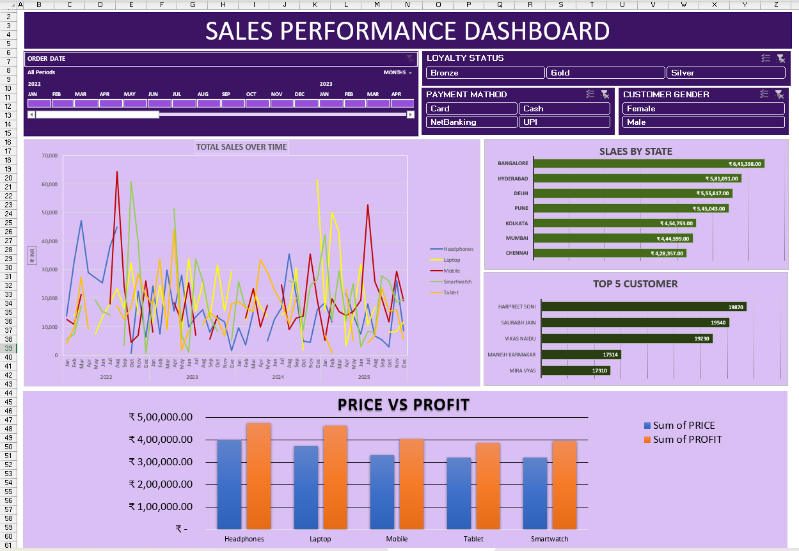

# 📊 SALES PERFORMANCE DASHBOARD    

  
  
  

---

## 📑 Table of Contents
- [Overview](#-overview)
- [Features](#-features)
- [Key Insights](#-key-insights)
- [Dashboard Preview](#-dashboard-preview)
- [Tools & Techniques](#-tools--techniques)
- [How to Use](#-how-to-use)
- [Author](#-author)

---

## 📌 Overview  
This project is a **dynamic and interactive Sales Performance Dashboard** built in **Microsoft Excel**.  
It provides actionable insights into **sales trends, profits, and customer behavior** with easy-to-use filters and visualizations.  

---

## 🚀 Features  
- **Order Date Filter** → View sales across multiple years (2020–2025).  
- **Dynamic Slicers** → Filter by Loyalty Status, Payment Method, and Customer Gender.  
- **Total Sales Over Time** → Line chart tracking product sales trends.  
- **Sales by State** → Compare regional performance.  
- **Top 5 Customers** → Identify key revenue-generating customers.  
- **Price vs Profit Analysis** → Bar chart showing profitability by product category.  

---

## 🔑 Key Insights  
- Track performance by **location, time period, and customer segments**.  
- Identify **high-value customers** and **top-performing states**.  
- Compare **price vs profit margins** across different products.  

---

## 📊 Dashboard Preview  
👉 *(Add screenshots of your dashboard here for better presentation)*  

Example:  
  

---

## 🛠 Tools & Techniques  
- **Microsoft Excel** (Pivot Tables, Slicers, Dynamic Charts)  
- **Data Visualization & Dashboard Design**  
- **Sales & Profitability Analysis**  

---

## 🚀 How to Use  
1. Download the Excel file from this repository.  
2. Open it in **Microsoft Excel (2016 or later)**.  
3. Use the provided **filters and slicers** to explore insights.  

---

## 👤 Author  
**Aryan Singh**  

- 🔗 LinkedIn: (www.linkedin.com/in/
aryansingh7396
Vanity URL name
)  
- 💻 GitHub: [Aryansingh220](https://github.com/Aryansingh220)  

---

✨ This dashboard can be used by **business analysts, sales teams, and managers** to make data-driven decisions.  
